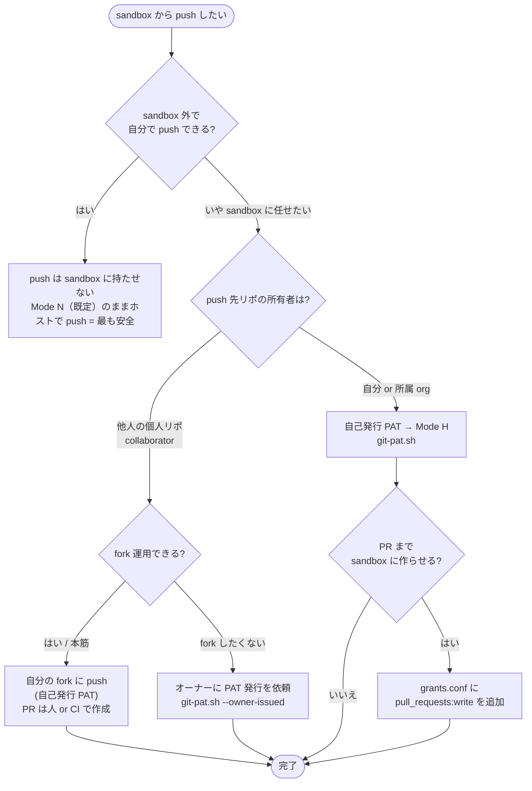
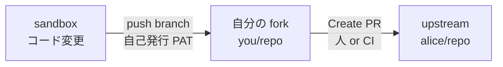
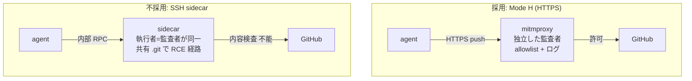

# Git 運用ガイド (sandbox からの push / PR)

sandbox 内の agent から GitHub へ `git push` / PR 作成を行うときの方式選定と手順。
結論を先に言うと **「自分が所有するリポは自己発行 PAT」「所有しないリポは fork が本筋、
無理ならオーナー発行 PAT」**。SSH / 専用 sidecar は採らない (理由は末尾の[参考](#参考))。

---

## 前提・注意 (全方式共通)

push を sandbox に任せる全方式に共通の前提。**最初に確認すること。**

- **branch protection はサーバ側で**: agent の force push / `main` 直 push / ブランチ削除を sandbox
  側で止めるのは難しい。GitHub の branch protection / ruleset を最終防衛線にする
- **PAT は平文で `git/credentials` に保存される**: ディスク盗難に弱い。だからこそ scope を 1 リポ + 短期限に絞る
- **mitmproxy が HTTPS を復号する**: push 本文 (差分) は proxy で一瞬平文になる。自分のインフラを通すだけだが、
  設定次第でログに残せる構造なので意識しておく
- **classic PAT は使わない**: `repo` 全権だと sandbox 内 agent から全リポに push 可能になる。
  fine-grained PAT で対象を絞ること

---

## まずこのフローで方式を選ぶ

> **Mode N / Mode H とは** (`sandbox.config` の `GIT_AUTH_MODE`): **Mode N** = push を sandbox に
> 渡さない既定状態 (clone/fetch/pull は可、push はホストで行う)。**Mode H** = sandbox 専用の
> fine-grained PAT を mount して sandbox から push 可能にする状態。詳細は[後述](#mode-h-の仕組み)。



### 早見表

| 状況 / push 先リポの所有者 | 方式 | sandbox に渡す権限 | PR 自動作成 | commit/PR の名義 |
|---|---|---|---|---|
| sandbox 外で自分で push できる | **Mode N (既定・ホストで push)** | なし | — | 自分 |
| 自分 / 所属 org | 自己発行 PAT (Mode H) | 当該 1 リポ | ◯ (`pull_requests:write` 追加時) | 自分 |
| 他人の個人リポ **(本筋)** | **fork + 自己発行 PAT** | **自分の fork のみ** | △ (PR は人/CI) | 自分 |
| 他人の個人リポ (fork 不可時) | オーナー発行 PAT | 当該 1 リポ | ◯ | **オーナー名義** |

> **なぜ他人の個人リポで fork が本筋か**: fine-grained PAT は「自分 or 所属 org が所有する
> リポ」しか対象にできない。他人の個人リポは collaborator でも PAT を発行できないため、
> **自分が所有する fork に push する**のが最もスコープが小さく安全。

---

## 必要な権限 (fine-grained PAT)

典型ゴールは **コード変更 → branch を publish → PR 作成**。fine-grained PAT の権限は:

```
PERMISSIONS="contents:write pull_requests:write metadata:read"
```

| 権限 | 用途 | 必須? |
|---|---|---|
| `contents:write` | branch の push | 必須 |
| `metadata:read` | 常時必須 (GitHub が自動付与) | 必須 |
| `pull_requests:write` | **同じトークンで PR を作る**場合 (`gh pr create` / API) | PR を sandbox に作らせる時のみ |

- **force push / `main` 直 push はトークンでは防げない** → 冒頭「前提・注意」のとおり branch
  protection / ruleset で縛る (`Require a pull request before merging` を入れると PR 必須にできる)
- fork + 人/CI が PR を作る運用なら `pull_requests:write` は不要 (`contents:write` だけでよい)

---

## ケース別の手順

### A. 自己発行 PAT — 自分 / 所属 org のリポ

```bash
cp .claude-sandbox/grants.conf.example .claude-sandbox/grants.conf
$EDITOR .claude-sandbox/grants.conf      # RESOURCE_OWNER=自分, REPOSITORIES=自分のリポ
./.claude-sandbox/git-pat.sh             # 自己発行 (ブラウザ + チェックリスト + 検証)
./.claude-sandbox/setup.sh --reconfigure # GIT_AUTH_MODE=H で git/credentials を mount
```

### B. fork + 自己発行 PAT — 他人の個人リポ (本筋)



> sandbox が書き込むのは**自分の fork (you/repo) だけ**。PR の base は upstream (alice/repo) という別リポ。

1. GitHub 上で `alice/repo` を**自分のアカウントに fork** (`you/repo`)
2. `grants.conf` を `RESOURCE_OWNER=you` / `REPOSITORIES="you/repo"` にして自己発行 (手順 A と同じ)
3. sandbox は**自分が所有する fork に branch を push** (← fine-grained PAT で問題なく通る)
4. PR は web か `gh` で `you:branch → alice/<base>` を作成

- **sandbox が触るのは自分の fork だけ** = 他人リポへの書き込み権限を sandbox に渡さない。最小 blast radius
- **制約**: cross-fork PR の **API 自動作成は upstream(alice)への `pull_requests:write` が必要**。
  fork PAT だけでは作れない。「branch push までを sandbox、PR 作成は人/CI」なら fork が最強。
  PR 作成まで完全自動化したいならケース C へ

### C. オーナー発行 PAT — fork 不可時

collaborator は他人の個人リポ向け PAT を発行できないので、**オーナーに発行してもらう**。
`git-pat.sh --owner-issued` がオーナーに送る依頼テキストを生成し、返ってきたトークンを検証する。

```bash
cp .claude-sandbox/grants.conf.example .claude-sandbox/grants.conf
$EDITOR .claude-sandbox/grants.conf      # RESOURCE_OWNER=alice(オーナー), REPOSITORIES="alice/repo"
./.claude-sandbox/git-pat.sh --owner-issued
#   → 「オーナーに送る発行手順」を表示。それをオーナーに渡す
#   → オーナーが発行したトークンを貼り付け → 検証 → git/credentials 生成
./.claude-sandbox/setup.sh --reconfigure
```

- **identity 帰属**: push / PR 作成は **オーナー名義**になる (commit の author は
  `GIT_USER_NAME/EMAIL` であなた名義に保てる)。bot 的運用なら通常許容できる
- オーナーは自分のリポを resource owner にできるので、`grants.conf` の権限で普通に発行可能

---

## `git-pat.sh` の使い方

| モード | 用途 | ブラウザ |
|---|---|---|
| `git-pat.sh` | 自己発行 (自分/org のリポ、自分の fork) | 自分のブラウザで開く |
| `git-pat.sh --owner-issued` | オーナーに発行依頼 (他人の個人リポ) | 開かない (依頼テキストを出力) |

どちらも共通して:

1. `grants.conf` を読む (トークン本体ではなく「何を許可するか」の宣言)
2. `grants.conf` から **発行 UI で何を選ぶかのチェックリスト**を生成
   (GitHub は fine-grained PAT の URL 事前入力に未対応なので、選択は手動)
3. 貼り付けたトークンを GitHub API で検証
   - **正テスト**: `REPOSITORIES` に到達でき、`contents:write` なら push 権限があるか
   - **負テスト**: `DENY_CONTROL_REPO` に**到達できない** (スコープが広すぎないか実測)
4. 検証 OK なら `git/credentials` を生成 (`chmod 600`)

---

## Mode H の仕組み

`GIT_AUTH_MODE=H` を選ぶと、ホストの git 設定とは**完全に分離**した sandbox 専用の認証を mount する。

| | N: 無効 (default) | H: sandbox 専用 PAT を read-only mount |
|---|---|---|
| sandbox 内での push | ✗ | ✓ |
| 認証情報の場所 | — | `git/credentials` (`git-pat.sh` が発行) を ro mount |
| コンテナ用 `.gitconfig` | — | `git/gitconfig` を `setup.sh` が生成 (`helper=store` + identity) |
| ホスト `~/.git*` への依存 | — | なし (GCM / keychain と独立に使える) |
| コンテナへの焼き込み | — | なし (image / volume には残らない) |

- **commit identity**: `setup.sh` が対話時にホストの `git config --global user.name/email` を
  **デフォルト提示**し (空なら未入力で表示)、確認/上書きした値を `sandbox.config` の
  `GIT_USER_NAME/EMAIL` に保存 → 生成 `git/gitconfig` の `[user]` に焼き込む。空のままだと
  コンテナ内 commit は identity 未設定で失敗する (`--global` は直値のみ参照。`includeIf` や
  repo-local は辿らないので、それらで管理しているなら明示入力すること)
- **PAT の期限切れ**: `EXPIRY_DAYS` で失効。切れたら `git-pat.sh` を再実行して `git/credentials` を
  上書きすればよい (mount は ro なので再起動不要で反映)
- **ホスト側は独立**: ホストは GCM / keychain / `gh auth login` など何を使ってもよい

---

## 参考

ここから先は設計判断の背景。運用するだけなら読まなくてよい。

### セキュリティ根拠 (なぜ HTTPS / Mode H に寄せるか)

「所有しないリポへの push」を SSH deploy key + 専用 sidecar で実装する案は**不採用**。理由は
**独立した監査者 (reference monitor) を失い、かつ内容監査ができないから**。



- **Mode H が安全な理由**: push は **mitmproxy という独立コンテナ**を必ず通る。agent が乗っ取られても
  mitmproxy の allowlist もログも改竄できない (= 改竄不能・迂回不能・独立した参照モニタ)。さらに
  scope は **fine-grained PAT が server 側に固定**する
- **SSH sidecar を採らない理由**:
  1. **執行者と監査者が同一** — push を実行する sidecar が自分でログを書く。乗っ取られれば監査も無価値
  2. **SSH は内容監査できない** — mitmproxy が HTTPS を覗けるのは信頼 CA を握る (SSL Bump) から。
     SSH の host-key 認証はまさにそれを防ぐ仕組みで、独立した内容検査ゲートウェイを作れない
  3. **共有 working tree が RCE 経路** — sidecar が agent の書ける `/workspace/.git` で `git` を走らせると、
     agent が仕込んだ `core.sshCommand` / hooks / alias が sidecar 権限で実行され、deploy key を奪える
- 結論: **所有しないリポは fork (自分のリポに閉じる) か、オーナー発行 PAT (HTTPS/Mode H に乗る)**。
  どちらも mitmproxy + server 側 scope + branch protection の 3 本柱を維持できる
